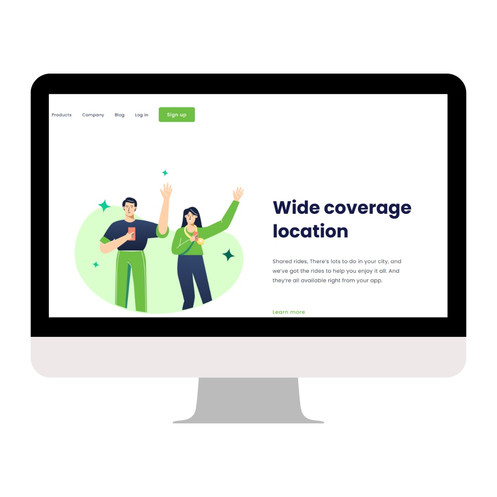

<h1>Desafio CSS - Projeto Responsivo 👨‍💻</h1>

  Este projeto é uma simulação de página inicial de uma aplicação, com header de navegação, seção principal com título, descrição, logo e botão de ação. Estudo de layout responsivo usando HTML e CSS.

<h2>⚒ Tecnologias Utilizadas</h2>

  
  
  

<h2>🌐 Estrutura do Projeto</h2>
<ul>
  <li>📄 <strong>index.html</strong> - Página principal com layout e conteúdo</li>
  <li>🎨 <strong>styles.css</strong> - Estilos aplicados ao header, logo, botões e seções</li>
  <li>🖼 <strong>assets/</strong> - Pasta para imagens (logo e capturas do projeto)</li>
</ul>

<h2>🎨 Destaques do CSS</h2>
<ul>
  <li>📌 Fonte Poppins aplicada globalmente para tipografia moderna e legível</li>
  <li>📌 Reset de margens e padding com <code>* { margin:0; padding:0; box-sizing:border-box; }</code></li>
  <li>📌 Header com links e botão de ação "Sign up", com cores #6FBF44 e borda arredondada</li>
  <li>📌 Logo dimensionada com <code>width:595px</code> e <code>height:500px</code>, alinhada à esquerda</li>
  <li>📌 Seção com título grande (<code>font-size:62px</code>) e parágrafo explicativo</li>
  <li>📌 Botão "Learn more" transparente com hover pointer e cor #6FBF44</li>
</ul>

<h2>📷 Visualização do Projeto</h2>

<blockquote>💡 Certifique-se de que a imagem está na pasta <strong>assets</strong> e com o nome correto.</blockquote>

<h2>🔗 Navegação e Funcionalidades</h2>
<ul>
  <li>🏠 Header com links: Products, Company, Blog e Log in</li>
  <li>✏️ Botão de ação "Sign up" no header</li>
  <li>🌟 Seção principal com logo, título "Wide coverage location", descrição e botão "Learn more"</li>
  <li>🎨 Layout responsivo preparado para diferentes resoluções</li>
</ul>

<h2>💡 Observações do Projeto</h2>

  Este projeto é um estudo prático de HTML e CSS, com foco em layout responsivo, tipografia moderna, cores harmoniosas e organização de conteúdo. 

</body>
</html>
